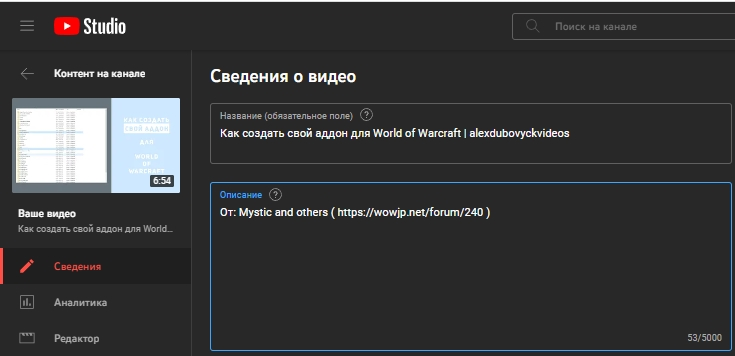

# YouTube chapter creator helper

До ■ После

## Описание
В строке 
``
https://youtu.be/5lwH4APNOuo?t=216
``
преобразует число в
``216``
в человеческие ``3 минуты и 36 секунд``

Вдохновился после просмотра вот [этого](https://youtu.be/Gmt3Nk9KoMc) видеоролика.

Решил сделать свой проект, чтоб более быстро и более удобно нарезать видео на главы.

## Использование
- нажать ``Копировать URL видео с привязкой по времени``

- открыть ``main.py`` и ввести результат копирования
- в буфере и в консоли окажется отформатированный вариант для вставки в описание под видео в творческой студии

## Ссылки
| Описание | Ссылка |
| ------ | ------ |
Репо: | https://github.com/gitalexhubuser/YouTube-timecode-helper
